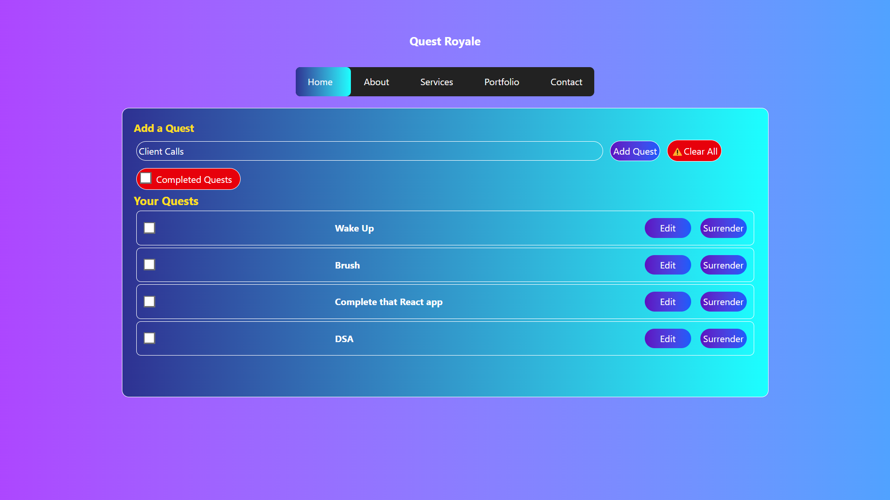

# ⚔️ Quest Royale

A fun and interactive React-based quest tracker app styled with Tailwind CSS. Track your daily tasks as heroic quests!


## 🚀 Features

- 📜 Add, edit, and delete quests
- ✅ Mark quests as completed
- 🎯 Filter to show completed quests
- 💾 LocalStorage persistence
- 🛡️ Clean, responsive UI with Tailwind CSS
- ⚙️ Custom-styled checkboxes and buttons

## 📸 Preview

 <!-- See instructions below to add this -->

## 🛠️ Built With

- [React](https://reactjs.org/)
- [Tailwind CSS](https://tailwindcss.com/)
- [Vite](https://vitejs.dev/)
- [UUID](https://www.npmjs.com/package/uuid)
- [Vercel](https://vercel.com/) for deployment

## 🧪 Installation

```bash
git clone https://github.com/ankurashish/Quest-Royale.git
cd quest-royale
npm install
npm run dev
```

## 🌐 Live Demo

👉 [https://quest-royale.vercel.app](https://quest-royale.vercel.app)

## 📄 License

This project is open source and free to use.

---

> ✨ Made with pride & code by [Ankur Ashish](https://github.com/ankurashish)